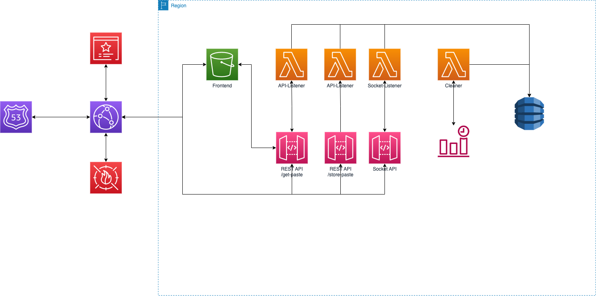

[![Contributors][contributors-shield]][contributors-url]
[![Forks][forks-shield]][forks-url]
[![Stargazers][stars-shield]][stars-url]
[![Issues][issues-shield]][issues-url]
[![GPL3 License][license-shield]][license-url]
[![LinkedIn][linkedin-shield]][linkedin-url]
[![Ask Me Anything][ask-me-anything]][personal-page]
<br>
[](https://deepscan.io/dashboard#view=project&tid=20369&pid=23831&bid=728049)
[](https://deepsource.io/gh/stiliajohny/pasteportal/?ref=repository-badge)
[](https://www.codacy.com/gh/stiliajohny/pasteportal/dashboard?utm_source=github.com&utm_medium=referral&utm_content=stiliajohny/pasteportal&utm_campaign=Badge_Grade)
[](https://github.com/stiliajohny/pasteportal/actions/workflows/sam_deploy.yml)
[](https://github.com/stiliajohny/pasteportal/actions/workflows/codeql.yml)

<!-- PROJECT LOGO -->
<br />
<p align="center">
  <a href="https://github.com/stiliajohny/pasteportal">
    
  </a>

  <h3 align="center">PastePortal</h3>

  <p align="center">
A text sharing tool for developers
    <br />
    <a href="https://pasteporta.info">Frontend</a>
    ·
    <a href="https://marketplace.visualstudio.com/items?itemName=JohnStilia.pasteportal">VSCode Extension</a>
    </br>
    <a href="https://github.com/stiliajohny/pasteportal/issues/new?labels=i%3A+bug&template=1-bug-report.md">Report Bug</a>
    ·
    <a href="https://github.com/stiliajohny/pasteportal/issues/new?labels=i%3A+enhancement&template=2-feature-request.md">Request Feature</a>

  </p>
</p>

<!-- TABLE OF CONTENTS -->

## Table of Contents

- [Table of Contents](#table-of-contents)
- [About The Project](#about-the-project)
  - [Built With](#built-with)
- [Getting Started](#getting-started)
  - [Architecture Diagram](#architecture-diagram)
  - [Prerequisites](#prerequisites)
  - [Installation](#installation)
- [Usage](#usage)
- [Using the VSCode Extension](#using-the-vscode-extension)
- [Using the Frontend](#using-the-frontend)
- [Roadmap](#roadmap)
- [Contributing](#contributing)
- [License](#license)
- [Contact](#contact)
- [Acknowledgements](#acknowledgements)

<!-- ABOUT THE PROJECT -->

## About The Project

PastePortal is a revolutionary new application that makes sharing text a breeze. Designed with developers in mind, PastePortal eliminates the need for the traditional copy-paste method, making it easy to share context without any additional complexity.

The application comes with a VSCode extension, as well as, a frontend, making it accessible to a wide range of users.
Whether you're working on a large project with multiple team members or simply need to share a small snippet of code, PastePortal is the perfect solution.
With its user-friendly interface and powerful functionality, it's no wonder why PastePortal is quickly becoming the go-to choice for developers everywhere.

Try it out today and see the difference for yourself!

### Built With

- Python
- Terraform
- SAM
- Javascript
- HTML
- CSS

---

<!-- GETTING STARTED -->

## Getting Started

### Architecture Diagram

<!-- add a folding section -->
<details>
<summary>Click to expand!</summary>
<p>



</details>

### Prerequisites

- SAM CLI - [Install the SAM CLI](https://docs.aws.amazon.com/serverless-application-model/latest/developerguide/serverless-sam-cli-install.html)
- Python3.8 or higher
- AWS CLI already configured with Administrator permission
- AWS account with Administrator permission
- Terraform 1.0 or higher

### Installation

- Clone the repo

```sh
git clone https://github.com/stiliajohny/python-pasteporta
```

> Update the Route53 zone id in `aws-deployment/terraform/route53.tf` with the domain you want to use.

- Run SAM build

```sh
sam build
```

- Run SAM deploy

```sh
sam deploy --guided
```

- Run Terraform

```sh
terraform init
terraform apply
```

---

## Usage

## Using the VSCode Extension

The VSCode extension is available on the [VSCode Marketplace](https://marketplace.visualstudio.com/items?itemName=JohnStilia.pasteportal).

After installing the extension, you can use the command `PastePortal: Share` to share the current selection.

In order to retrive the content of a paste, you can use the command `PastePortal: Retrieve` and enter the paste id.

## Using the Frontend

The frontend is available [here](https://pasteportal.info).

---

## Roadmap

See the [open issues](https://github.com/stiliajohny/pasteportal/issues) for a list of proposed features (and known issues).

---

<!-- CONTRIBUTING -->

## Contributing

Contributions are what make the open source community such an amazing place to be learn, inspire, and create. Any contributions you make are **greatly appreciated**.

1. Fork the Project
2. Create your Feature Branch (`git checkout -b feature/AmazingFeature`)
3. Commit your Changes (`git commit -m 'Add some AmazingFeature'`)
4. Push to the Branch (`git push origin feature/AmazingFeature`)
5. Open a Pull Request

---

<!-- LICENSE -->

## License

Distributed under the GPLv3 License. See `LICENSE` for more information.

<!-- CONTACT -->

## Contact

John Stilia - stilia.johny@gmail.com

<!--
Project Link: [https://github.com/your_username/repo_name](https://github.com/your_username/repo_name)
-->

---

<!-- ACKNOWLEDGEMENTS -->

## Acknowledgements

- [Danut](https://github.com/DanutEne)
- [Ahley](https://github.com/cur50r)
- [GitHub Emoji Cheat Sheet](https://www.webpagefx.com/tools/emoji-cheat-sheet)
- [Img Shields](https://shields.io)
- [Choose an Open Source License](https://choosealicense.com)
- [GitHub Pages](https://pages.github.com)

<!-- MARKDOWN LINKS & IMAGES -->
<!-- https://www.markdownguide.org/basic-syntax/#reference-style-links -->

[contributors-shield]: https://img.shields.io/github/contributors/stiliajohny/pasteportal.svg
[contributors-url]: https://github.com/stiliajohny/pasteportal/graphs/contributors
[forks-shield]: https://img.shields.io/github/forks/stiliajohny/pasteportal.svg
[forks-url]: https://github.com/stiliajohny/pasteportal/network/members
[stars-shield]: https://img.shields.io/github/stars/stiliajohny/pasteportal.svg
[stars-url]: https://github.com/stiliajohny/pasteportal/stargazers
[issues-shield]: https://img.shields.io/github/issues/stiliajohny/pasteportal.svg
[issues-url]: https://github.com/stiliajohny/pasteportal/issues
[license-shield]: https://img.shields.io/github/license/stiliajohny/pasteportal
[license-url]: https://github.com/stiliajohny/pasteportal/blob/master/LICENSE.txt
[linkedin-shield]: https://img.shields.io/badge/-LinkedIn-black.svg

[linkedin-url]: https://linkedin.com/in/]/
[product-screenshot]: .assets/screenshot.png
[ask-me-anything]: https://img.shields.io/badge/Ask%20me-anything-1abc9c.svg
[personal-page]: https://github.com/stiliajohny
